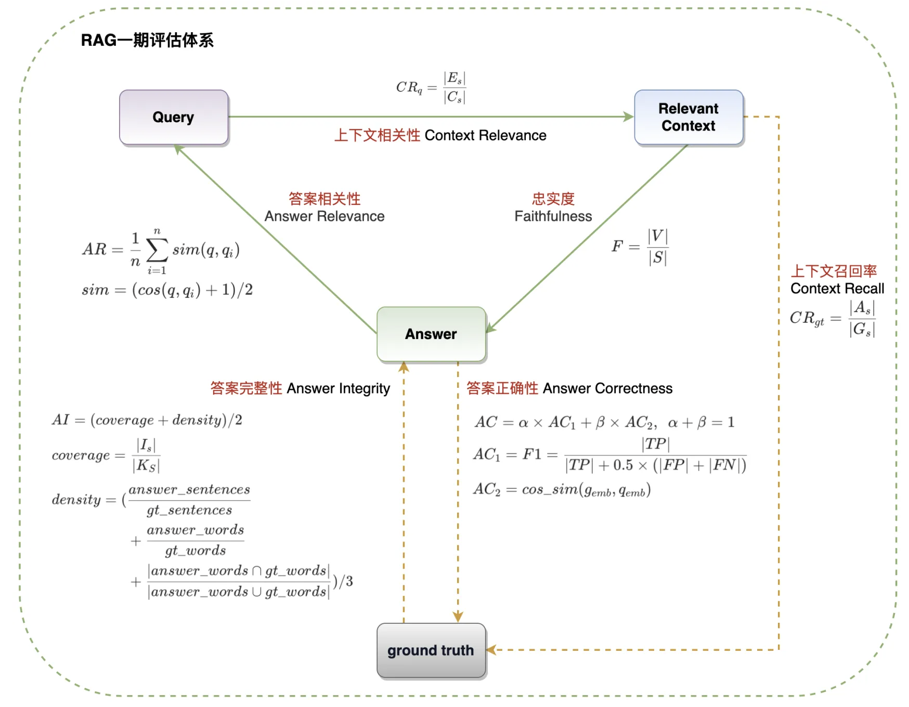
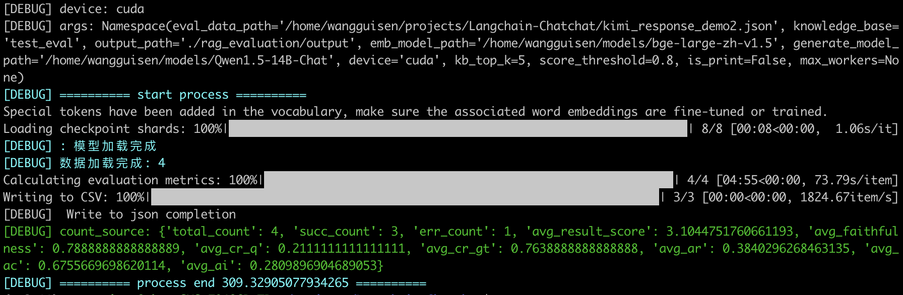

# rag_evaluation




+ 目前需放在 chatchat 根目录。
+ `knowledge_base`为 chatchat 下知识库目录。


# 原理详解

见我公众号文章：

https://mp.weixin.qq.com/s?__biz=Mzk0MzIzODM5MA==&mid=2247487572&idx=1&sn=8f975b6f0359e199d7521b6408afc55b&chksm=c337adcdf44024db062c5825f30c34e304321d0c8d2db8baea57ace285703ec91672786fd5ee#rd


欢迎关注我的公众号：


# RUN

```shell
cd rag_evaluation
```


使用本地模型：

```shell
CUDA_VISIBLE_DEVICES=1,2,3 python -m rag_evaluation \
                                    --eval_data_path /home/wangguisen/projects/Langchain-Chatchat/kimi_response_demo2.json \
                                    --knowledge_base test_eval \
                                    --output_path ./rag_evaluation/output \
                                    --emb_model_path /home/wangguisen/models/bge-large-zh-v1.5 \
                                    --generate_model_path /home/wangguisen/models/Qwen1.5-14B-Chat \
                                    --device cuda \
                                    --kb_top_k 5 \
                                    --score_threshold 0.8
```


使用 OpenAI 模型：

```shell
CUDA_VISIBLE_DEVICES=1,2,3 python -m rag_evaluation \
                                    --eval_data_path /home/wangguisen/projects/Langchain-Chatchat/kimi_response_demo2.json \
                                    --knowledge_base test_eval \
                                    --output_path ./rag_evaluation/output \
                                    --emb_model_path /home/wangguisen/models/bge-large-zh-v1.5 \
                                    --device cuda \
                                    --kb_top_k 5 \
                                    --score_threshold 0.8
```


批量：

```shell
nohup sh ./rag_evaluation/run.sh > ./rag_evaluation/output/run.log 2>&1 &
```


run successfully：




# 结果

默认的结果输出路径：`./outputs/`

| model            | 知识库检索 | total_count | succ_count | err_count | avg_result_score | avg_faithfulness | avg_cr_q | avg_cr_gt | avg_ar | avg_ac | avg_ai |
| ---------------- | ---------- | ----------- | ---------- | --------- | ---------------- | ---------------- | -------- | --------- | ------ | ------ | ------ |
| Qwen1.5-14B-Chat | default    | 663         | 255        | 408       | 3.4555           | 0.8723           | 0.2199   | 0.9170    | 0.4621 | 0.7004 | 0.2838 |
|                  |            |             |            |           |                  |                  |          |           |        |        |        |
|                  |            |             |            |           |                  |                  |          |           |        |        |        |


# TODO

- [ ] 多进程并行时，检索知识库（里面有线程）卡主。
- [x] OpenAI接口/大模型返回结果不稳定，`fix_lst`、`fix_json`函数待完善。
- [x] 流式写入结果。
- [x] 支持其它生成模型。
- [ ] 与 chatchat 解耦。
- [ ] 本地模型推理加速。
- [ ] 测试：大模型纠正返回结果。
- [ ] 语义相似用类BEG。
- [ ] （长期-持续）：大模型返回结果不稳定，优化评估。


